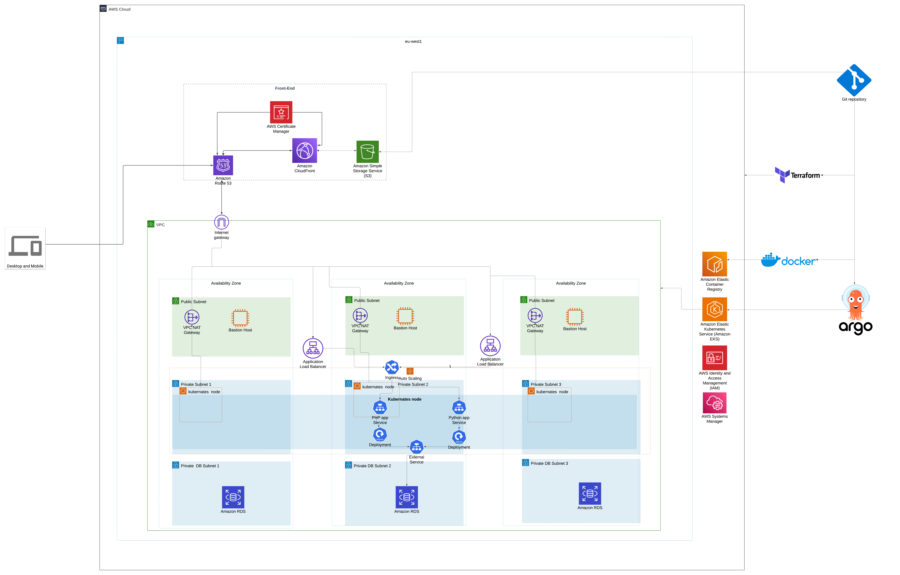

#  Knowledge City Infrastructure Project

## Overview

This project involves setting up a cloud-based infrastructure for Knowledge City, featuring a scalable and secure architecture. It includes hosting both frontend and backend applications, deploying containerized workloads using Kubernetes, provisioning infrastructure as code, and implementing CI/CD pipelines for seamless application delivery. Below, we provide details about the work completed, architectural components, and how the requirements outlined in the test were addressed.

## Architecture Design




The infrastructure is designed with the following layers:

1. **Frontend Layer**:
   - **Route 53**: Configured for DNS management.
   - **CloudFront**: Acts as a Content Delivery Network (CDN) to ensure low latency and secure content delivery.
   - **Amazon S3**: Hosts static assets for the frontend applications.
   - **AWS Certificate Manager (ACM)**: Provides SSL/TLS for secure communication.

2. **Networking Layer**:
   - **VPC**: A Virtual Private Cloud ensures isolated networking.
   - **Subnets**: Separate public and private subnets were provisioned.
   - **Internet Gateway** and **NAT Gateways**: Allow internet access for public and private resources.
   - **Application Load Balancers (ALB)**: Distribute traffic across multiple instances.

3. **Compute & Application Layer**:
   - **Amazon EKS**: Manages Kubernetes clusters for container orchestration.
   - **PHP Laravel App**: Backend application 1.
   - **Python Django App**: Backend application 2.
   - **Ingress Controller**: Manages routing for backend services.
   - **Horizontal Pod Autoscaling (HPA)**: Automatically scales pods based on demand.

4. **Database Layer**:
   - **Amazon RDS**: Configured with MySQL for high availability with primary and standby instances.

5. **Security and Management Layer**:
   - **Bastion Hosts**: Provide secure administrative access.
   - **AWS IAM**: Configured for identity and access management.
   - **AWS Systems Manager**: Centralized resource management.

6. **CI/CD Setup**:
   - **GitHub Actions**: Used for CI pipelines to build and deploy applications.
   - **ArgoCD**: Automates continuous deployment in Kubernetes.

## Folder Structure

```plaintext
.
├── README.md
├── knowledge_city.png
├── kubernates_manifest
│   ├── apps
│   │   ├── php_app.yaml
│   │   └── python_app.yaml
│   ├── common
│   │   └── controller.yaml
│   ├── php_app
│   │   ├── cm.yml
│   │   ├── deployment.yaml
│   │   ├── hpa.yaml
│   │   ├── secrets.yml
│   │   └── service.yaml
│   └── python_app
│       ├── deployment.yaml
│       ├── hpa.yaml
│       └── service.yaml
├── php-backend
├── python-backend
├── reactapp-frontend
├── svelte-frontend
└── terraform_infra
    ├── bastionhost.tf
    ├── database.tf
    ├── ecr.tf
    ├── eks.tf
    ├── locals.tf
    ├── main.tf
    ├── modules
    │   ├── cloud-front
    │   ├── cloud-front-secure
```

## Work Done

### Infrastructure Setup

- **Terraform**: Used to provision VPC, subnets, EKS cluster, RDS database, ECR repository, S3 buckets for frontend hosting, and CloudFront for secure content delivery.
- **ECR**: Stores container images for backend services.

### Backend Applications

1. **PHP Laravel Application**:
   - Built and dockerized.
   - Configured to connect to the MySQL database provisioned by Terraform.

2. **Python Django Application**:
   - Built and dockerized.
   - Configured for containerized deployment.

Both applications were deployed to the EKS cluster using manifests in the `kubernates_manifest` folder.

### Frontend Applications

1. **React Application**:
   - Default React app hosted on S3 with CloudFront.

2. **Svelte Application**:
   - Default Svelte app hosted similarly on S3 with CloudFront.

### Kubernetes Deployment

- **Manifests**: Defined for both backend applications with ConfigMaps, Secrets, Deployments, Services, and Horizontal Pod Autoscalers (HPA).
- **Ingress Controller**: Configured to manage traffic routing.

### CI/CD Pipelines

- **GitHub Actions**:
  - Build and push container images to ECR for backend applications.
  - Deploy frontend applications to S3 and invalidate CloudFront caches.

- **ArgoCD**:
  - Handles continuous deployment for Kubernetes, pulling the latest images from ECR and updating the deployments automatically.

## Test Requirements Fulfilled

1. **Infrastructure Setup**:
   - Complete end-to-end infrastructure provisioning with Terraform.

2. **Backend Development**:
   - Two backend applications implemented and dockerized.

3. **Frontend Development**:
   - Two frontend applications hosted securely on S3 with CloudFront.

4. **Kubernetes Deployment**:
   - Kubernetes manifests and configurations defined for deployment.

5. **CI/CD Pipelines**:
   - GitHub Actions and ArgoCD used to automate CI/CD processes.

## How to Run

1. Clone the repository:
   ```bash
   git clone <repository-url>
   ```

2. Deploy infrastructure using Terraform:
   ```bash
   cd terraform_infra
   terraform init
   terraform apply
   ```

3. Build and deploy frontend backend applications:
   Github actions handles the build and deploy/push so you just need to update the code and push and the pipeline handles the rest.


5. Apply Kubernetes manifests:
   This is managed by argocd once an update is pushed argocd updates the applications with the latest changes.

## Conclusion

This README outlines the project structure, work done, and instructions for deploying the Knowledge City infrastructure. The setup fulfills all test requirements, delivering a robust, scalable, and secure solution.